# Data Pipeline: Watch → iPhone → Mac → Dashboard

End-to-end guide for moving captured swing data from the Apple Watch into the browser analytics dashboard.

## Overview

```mermaid
flowchart LR
  watchCapture[Watch captures motion] --> watchStore[Watch SwiftData store]
  watchStore --> wcSync[WatchConnectivity file transfer]
  wcSync --> phoneStore[iPhone SwiftData store]
  phoneStore --> phoneExport[iPhone Export / Share]
  phoneExport --> macRaw[data/raw/swings.json]
  macRaw --> featureGen[analyze_swings.py]
  featureGen --> macFeatures[analysis/output/swing_features.parquet]
  macRaw --> dashboardUI[Browser dashboard]
  macFeatures --> dashboardUI
```



| Stage | Device | What happens |
|-------|--------|--------------|
| 1. Capture | Watch | Motion samples saved as `SwingRecord` |
| 2. Sync | Watch → iPhone | JSON export transferred via WatchConnectivity |
| 3. Export | iPhone → Mac | Share/AirDrop `golf_swings_export.json` |
| 4. Import | Mac | Copy to `data/raw/` and generate feature files |
| 5. Analyze | Mac browser | Dashboard reads features + raw samples |

---

## Prerequisites

- **Paired devices:** Apple Watch and iPhone running the GolfSwingWatch apps
- **Same Wi‑Fi network:** Mac, iPhone, and Watch must be on the same network for watch deploy/sync
- **iPhone app opened once:** Initializes WatchConnectivity on the phone
- **Python venv** (for import/analysis):

```bash
python3 -m venv .venv
source .venv/bin/activate
pip install -r analysis/requirements.txt
```

- **Dashboard running** (Docker or local). See [analysis/web/README.md](analysis/web/README.md).

---

## Step 1: Record swings on the Watch

For **each swing**, use this sequence:

1. Tap **Start** — sample counter resets and begins climbing
2. Perform the swing
3. Tap **Stop** — counter stops increasing
4. Set **Rating**, **Club**, and **Notes** (optional)
5. Tap **Save Swing** — swing is stored on the watch

After save:
- Sample counter returns to **0**
- State returns to **Idle**
- Tap **Start** again before the next swing

> **Important:** Do not tap **Save** twice without a new **Start → Stop** cycle. That creates duplicate records with the same sensor data.

Each saved swing includes:
- Metadata: `id`, `date`, `rating`, `club`, `notes`
- Raw samples: accel, gyro, pitch, roll, yaw at ~50 Hz
- Event markers: `start`, `impact`, `followThrough` (when detected)
- Analytics and coaching recommendations

---

## Step 2: Transfer swings to the iPhone

There are two ways to get data onto the phone.

### Option A: Automatic sync on save

Each time you tap **Save Swing**, the watch queues a sync of that swing to the iPhone. If **Remove after iPhone sync** is enabled on the watch (default), those swings are deleted from the watch after the iPhone confirms they were saved.

### Option B: Send All to iPhone (manual batch)

1. Scroll down on the watch app
2. Confirm **Saved swings** count is greater than 0
3. Tap **Send All to iPhone**
4. Watch the status line below the button:
   - `Preparing...` / `Sending...` — export in progress
   - `Queued N swing(s) for iPhone` — file transfer started
   - `Sent to iPhone` — transfer completed
   - Error messages explain what went wrong (e.g. iPhone app not installed)

**Tips if sync fails:**
- Open the **iPhone app** at least once
- Keep iPhone unlocked and nearby
- Ensure Mac, iPhone, and Watch are on the **same Wi‑Fi network**

### Verify on iPhone

1. Open the **GolfSwingWatch** iPhone app
2. Go to **Sessions**
3. Check the **Watch Sync** section — status should show imported swings
4. Swings appear in the session list with club, date, rating, and sample count

---

## Step 3: Export from iPhone to Mac

The dashboard on your Mac does not read the iPhone directly. Export a JSON file first.

1. Open the iPhone app **Sessions** screen
2. Tap **Export** (top left)
3. Tap **Share** (top right) when it appears
4. Choose **AirDrop** to your Mac (or save to Files/iCloud and copy later)

The file is named `golf_swings_export.json`. It contains **all swings currently stored on the iPhone**, including full sensor samples.

> **macOS duplicate downloads:** If you AirDrop more than once, macOS keeps the first file as `golf_swings_export.json` and renames later exports to `golf_swings_export 2.json`, `golf_swings_export 3.json`, and so on. The file with the plain name is **not** always the newest — check modification dates in Finder or use `--latest` when importing (Step 4).

---

## Step 4: Import on Mac

From the **repo root** (`GolfSwingWatch/`):

### Recommended: import the newest export

```bash
analysis/import_watch_export.sh --latest
```

`--latest` finds the most recently modified `golf_swings_export*.json` in `~/Downloads` and imports it. Use this after every AirDrop to avoid picking a stale file.

### Alternative: import a specific file

Pass the path to the export AirDrop actually saved (quoted if the filename contains spaces):

```bash
analysis/import_watch_export.sh ~/Downloads/golf_swings_export.json
analysis/import_watch_export.sh "~/Downloads/golf_swings_export 4.json"
```

If you pass an older file and a newer export exists in the same folder, the script prints a **WARNING** and suggests `--latest`.

### Options

| Flag | Effect |
|------|--------|
| `--latest` | Import newest `golf_swings_export*.json` from `~/Downloads` |
| `--delete-raw` | Remove `data/raw/swings.json` after features are generated |
| `--help` | Show usage |

Combine flags in any order:

```bash
analysis/import_watch_export.sh --latest --delete-raw
```

### What the import script does

1. Copies the export to `data/raw/swings.json` (overwrites previous import)
2. Trims each swing to the detected phase window (address/takeaway through finish, max ~8 seconds)
3. Runs `analysis/analyze_swings.py` to build feature tables
4. Writes:
   - `analysis/output/swing_features.parquet`
   - `analysis/output/swing_features.csv`
5. Optionally removes the raw JSON with `--delete-raw`

Each import **replaces** the previous analysis dataset — it does not merge swings from multiple exports. To keep a dated snapshot, copy the export before importing (see below).

### Verify the import

The script prints how many records were loaded. You can also check manually:

```bash
# Record count in the raw export
python3 -c "import json; d=json.load(open('data/raw/swings.json')); r=d if isinstance(d,list) else d['records']; print(len(r), 'swings')"

# Record count in the feature table (requires venv)
source .venv/bin/activate
python -c "import pandas as pd; print(len(pd.read_parquet('analysis/output/swing_features.parquet')), 'swings')"
```

Compare the count to the swing list in the iPhone app. If numbers don't match, you likely imported the wrong file — re-run with `--latest`.

### Deleting stored swings

| Location | When | How |
|----------|------|-----|
| **Watch** | After iPhone confirms import (optional, on by default) | Toggle **Remove after iPhone sync** |
| **Watch** | Any time | Trash button on saved swing row |
| **iPhone** | On demand | Swipe left on session, or **Delete Swing** in detail view |
| **Mac analysis** | On demand | Re-import with `--delete-raw`, or delete `data/raw/swings.json` manually |

### Keep multiple sessions (optional)

Save dated copies before importing:

```bash
cp ~/Downloads/golf_swings_export\ 4.json data/raw/swings_2026-06-14.json
analysis/import_watch_export.sh data/raw/swings_2026-06-14.json
```

Only `data/raw/swings.json` is used by default for Movement Explorer. The import script overwrites it each run.

---

## After data reaches the Mac

The watch and iPhone steps are done once AirDrop (or Files copy) lands `golf_swings_export*.json` in **Downloads**. Everything below happens on the Mac only.

### Do this every time (manual)

```bash
# From repo root
analysis/import_watch_export.sh --latest
```

Then **refresh** the browser at **http://localhost:5173** (no Docker restart needed).

### What happens during import

| Step | Output | Purpose |
|------|--------|---------|
| Copy export → `data/raw/swings.json` | Raw JSON on disk | Movement Explorer reads full sensor traces |
| Trim idle noise | Updated `swings.json` | Crops to phase window (~8s max) per swing |
| `analyze_swings.py` | `swing_features.parquet` / `.csv` | KPIs, charts, phase metrics, fault flags |
| Browser refresh | Dashboard updates | New swings appear in table + Movement Explorer |

Each import **replaces** the previous Mac dataset (no merge). Compare swing counts with the iPhone app if anything looks missing.

### Auto-import watcher (optional)

Leave this running in a terminal while you practice — it imports whenever a new export appears in Downloads:

```bash
analysis/watch_downloads_import.sh
```

Import the newest file once and exit:

```bash
analysis/watch_downloads_import.sh --once
```

| Watcher flag | Effect |
|--------------|--------|
| `--downloads-dir PATH` | Watch a folder other than `~/Downloads` |
| `--poll-seconds N` | Poll interval when `fswatch` is not installed (default 5) |
| `--delete-raw` | Remove `data/raw/swings.json` after features are built |
| `--once` | Import newest export now, then exit |

For near-instant detection, install [fswatch](https://github.com/emcrisostomo/fswatch) (`brew install fswatch`). Without it, the script polls every few seconds.

### Mac quick checklist

```text
[ ] Dashboard running (docker compose … up)
[ ] iPhone: Export → Share → AirDrop to Mac
[ ] Mac:  analysis/import_watch_export.sh --latest
        — or leave analysis/watch_downloads_import.sh running
[ ] Mac:  Refresh http://localhost:5173
[ ] Optional: Pattern Inspector → Generate AI summary (OPENAI_API_KEY in analysis/web/.env)
[ ] Optional: verify swing count matches iPhone Sessions list
```

---

## Step 5: View the dashboard

### Start the dashboard (Docker)

```bash
cp analysis/web/.env.example analysis/web/.env   # first time only
docker compose -f analysis/web/docker-compose.yml --env-file analysis/web/.env up --build
```

Open **http://localhost:5173**

### What the dashboard shows

| Section | Data source | Content |
|---------|-------------|---------|
| KPIs, charts, table | `analysis/output/swing_features.parquet` | Per-swing metrics (tempo, peak rotation, etc.) |
| Movement Explorer | `data/raw/swings.json` | Raw time-series + 3D watch-face visualizer |
| Pattern Inspector | `swing_features.parquet` | Low vs high-rated cohort patterns and fault trends |

After importing new swings, **refresh the browser**. No Docker restart is needed — the compose file bind-mounts `analysis/output/` and `data/raw/` read-only into the API container.

For **Pattern Inspector**, rate some swings ≤2 and others ≥4 — all-middle ratings (e.g. every swing a 3) produce no cohort patterns. Optional **Generate AI summary** needs `OPENAI_API_KEY` in `analysis/web/.env`.

### Pattern report (CLI)

```bash
source .venv/bin/activate
python analysis/pattern_inspector.py --features analysis/output/swing_features.parquet
python analysis/pattern_inspector.py --output analysis/output/pattern_report.md
python analysis/pattern_inspector.py --llm --output analysis/output/pattern_report.md
```

Set `OPENAI_API_KEY` in your shell or `analysis/web/.env` (Docker) before using `--llm` or the dashboard **Generate AI summary** button.

### Generate features manually (without import script)

```bash
source .venv/bin/activate
python analysis/analyze_swings.py \
  --input data/raw/swings.json \
  --output-dir analysis/output
```

---

## File layout reference

```text
GolfSwingWatch/
  data/
    raw/
      swings.json              # latest raw export (Movement Explorer reads this)
  analysis/
    output/
      swing_features.parquet   # feature table (dashboard KPIs/charts)
      swing_features.csv       # same data in CSV form
    import_watch_export.sh     # one-command import helper
    watch_downloads_import.sh  # auto-import when AirDrop lands in Downloads
    analyze_swings.py          # feature extraction CLI
    pattern_inspector.py       # cohort pattern report CLI
    web/                       # Docker compose + web stack docs
```

---

## Quick reference checklist

```text
[ ] Watch: Start → swing → Stop → Save (repeat per swing)
[ ] Watch: Send All to iPhone (or rely on per-save sync)
[ ] iPhone: Confirm swings in Sessions / Watch Sync
[ ] iPhone: Export → Share → AirDrop to Mac
[ ] Mac:  analysis/import_watch_export.sh --latest  (or watch_downloads_import.sh)
[ ] Mac:  Refresh http://localhost:5173
```

---

## Troubleshooting

| Problem | Likely cause | Fix |
|---------|--------------|-----|
| Send All to iPhone unresponsive | Large export blocking UI | Rebuild watch app (recent fix); watch status line for errors |
| Sync not ready | iPhone app never opened | Launch iPhone app once |
| Swings not on iPhone | WatchConnectivity tunnel | Same Wi‑Fi on Mac/iPhone/Watch; keep devices unlocked |
| Dashboard 404 / empty | No feature files yet | Run `analysis/import_watch_export.sh --latest` or `analyze_swings.py` |
| New swings missing after import | Imported stale export file | macOS renamed newer AirDrops; use `--latest` or pick the newest `golf_swings_export*.json` in Downloads |
| Import script WARNING about newer file | Explicit path points to old export | Re-run with `--latest` |
| Movement Explorer empty | No raw JSON | Confirm `data/raw/swings.json` exists after import (omit `--delete-raw`) |
| Forgot to import after AirDrop | Manual step skipped | Run `--latest` or start `watch_downloads_import.sh` |
| Duplicate swings, same data | Saved without new capture | Use full Start → Stop → Save cycle each time |

---

## Related docs

- [analysis/README.md](analysis/README.md) — feature extraction and metrics
- [analysis/web/README.md](analysis/web/README.md) — dashboard setup, Docker, API
- [DATA_MODEL.md](DATA_MODEL.md) — `SwingRecord` schema
